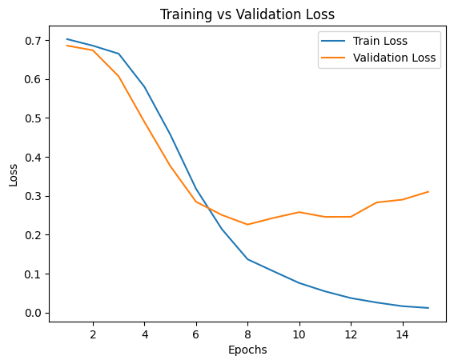
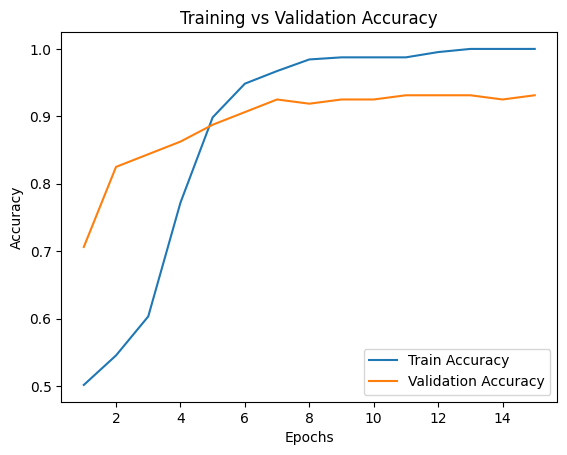
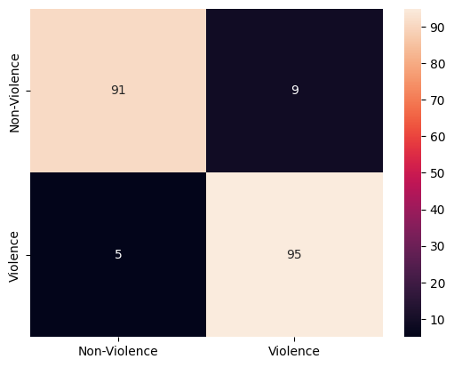

# BrutNet Violence Detection (CNN + GRU)

## Overview

This project implements a **BrutNet-inspired deep learning model** for detecting violent activities in videos.
The model combines **Convolutional Neural Networks (CNN)** for spatial feature extraction and **GRU (Gated Recurrent Unit)** for temporal pattern learning.

---

## Objective

To classify video segments into:

* **Violent (1)**
* **Non-violent (0)**

---

## Dataset

The training data is sourced from:

**Kaggle Violence Detection Dataset (frame-based video dataset)**

* Each folder represents a **video**
* Each image represents a **frame**

---

## Model Architecture

### 1. Input Processing

* 24 frames sampled per video
* Each frame resized to **(90 × 160 × 3)**
* Pixel normalization: **[0–255] → [0–1]**

Final input shape:

```
(24, 90, 160, 3)
```

---

### 2. Spatial Feature Extraction (TD-DCNN)

* TimeDistributed CNN applied to each frame
* Layers:
  * Conv2D + ReLU
  * Batch Normalization
  * MaxPooling
  * Global MaxPooling

Output:

```
(24, 512)
```

---

### 3. Temporal Modeling (GRU)
* GRU processes sequence of 24 frames
* Learns motion and temporal relationships

Output:

```
(64-dimensional feature vector)
```

---

### 4. Classification (Dense Layers)

Fully connected layers:

```
64 → 1024 → 1024 → 512 → 128 → 64 → 1
```

* ReLU activation (hidden layers)
* Dropout (0.5) for regularization
* Sigmoid activation (output)

---

## Training Configuration

* **Loss Function:** Binary Cross-Entropy
* **Optimizer:** Adam
* **Learning Rate:** 1e-5
* **Batch Size:** 24
* **Epochs:** up to 50

### Regularization:

* EarlyStopping (prevents overfitting)
* ModelCheckpoint (saves best model)

---

## Training Results

### Loss Curve

*(Insert loss graph here)*



---

### Accuracy Curve

*(Insert accuracy graph here)*



---

## Confusion Matrix

*(Insert confusion matrix here)*



---

## Evaluation Metrics

* **Accuracy**
* **Loss**
* **Precision & Recall**
* **ROC / PR Curve**

---

## Pipeline Summary

```
Video Folder
    ↓
Frame Sampling (24 frames)
    ↓
Resize & Normalize
    ↓
TD-CNN (Spatial Features)
    ↓
GRU (Temporal Learning)
    ↓
Dense Layers
    ↓
Prediction (Violent / Non-violent)
```

---

## Key Highlights

* Combines **spatial + temporal learning**
* Handles **video data as frame sequences**
* Uses **GRU for efficient sequence modeling**
* Designed for **real-world surveillance applications**

---

## Future Improvements

* Add attention mechanism
* Improve dataset diversity
* Deploy as real-time system
* Optimize model size

---

## Summary

This model demonstrates how combining CNN and RNN architectures can effectively detect violence in videos by analyzing both **visual features and motion patterns**.

---
